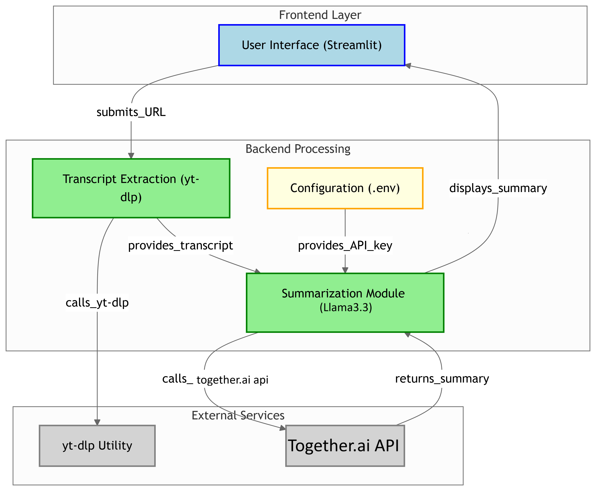

# YouTube Video Summarizer (with Together.ai)

This project extracts YouTube video transcripts and summarizes them using Togethers's API.

## Features
- Input a YouTube video URL
- Extract the transcript using `yt-dlp`
- Send the transcript to Llama3.3 for summarization
- View the summary in a Streamlit app
  
## 🧭 Workflow Diagram




## Setup Instructions

```bash
git clone git@github.com:2abet/YTsummarizer.git
cd youtube_summarizer
pip install -r requirements.txt
cp app/.env.example app/.env
```

Add your Together API key in the `.env`/Secrets file:

```
TOGETHER_API_KEY=your_deepseek_api_key_here
```

## Run the App

```bash
streamlit run app/app.py
```
